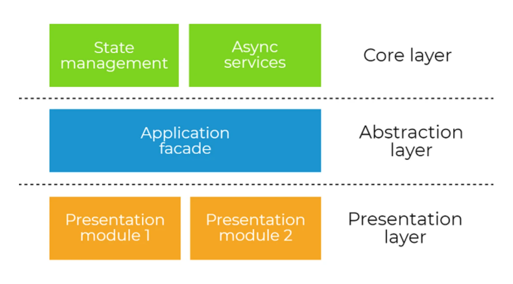

# app 

We base our application architecture on the post [Angular Architecture Patterns and Best Practices (that help to scale)](https://dev-academy.com/angular-architecture-best-practices/) from Bartosz Pietrucha. 

Our system is decomposed in three main abstraction layers:

## Presentation layer 
The only responsibilities of this layer are to present and to delegate. In other words, it presents the UI and delegates user’s actions to the core layer, through the abstraction layer. It knows what to display and what to do, but it does not know how the user’s interactions should be handled.

### components 
Each angular component has a subfolder containing three main different files:

1. `<name>.component.html`: HTML 
2. `<name>.component.scss`: styles 
3. `<name>.component.ts`: logic 

## Abstraction layer 
The abstraction layer decouples the presentation layer from the core layer and also has it’s very own defined responsibilities. This layer exposes the streams of state and interface for the components in the presentation layer, playing the role of the facade.

### facade 
We distinguish the `DataFacade`, `LabelLevelFacade` and `ParagraphLevelFacade` facades.

## Core layer 
Here is where core application logic is implemented. All data manipulation and outside world communication happen here. 

### api 
API services have only one responsibility - it is just to communicate with API endpoints and nothing else. We should avoid any caching, logic or data manipulation here. 

There are two API services: 

1. `DocumentApi`: contains all the API calls related to documents (i.e `/api/document`).
2. `UserApi`: contains all the API calls related to users (i.e. `/api/user`).

### models 
Data representations of 

- Document
- Label 
- Layout
- Paragraph 

and useful interfaces

- Feature configuration 
- Fixation area

used through the different layers of the application.

### (general) services 
Encapsulate business logic that is not strictly related to data management or api calls.

### state

Encapsulates the state management. To manage our state we simply use BehaviourSubjects or ReplaySubjects. Having this kind abstraction gives us a lot of flexibility and allows to change the way we manage state not even touching the presentation layer.

There are three different states:

1. `DataState`:
2. `LabelLevelState`:
3. `ParagraphLevelState`:
