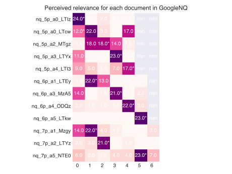
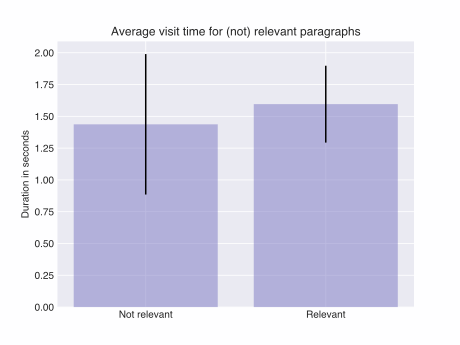
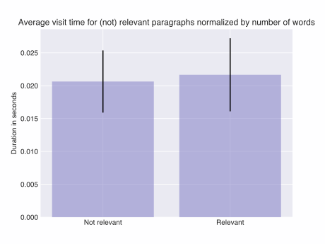
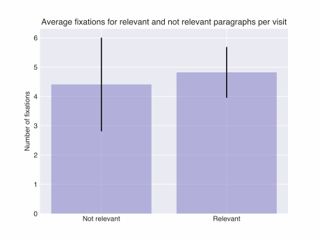
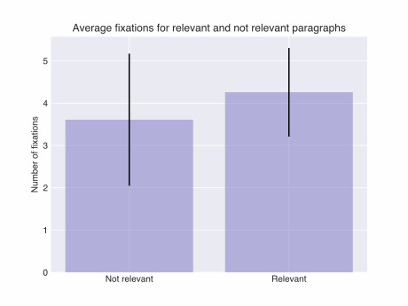
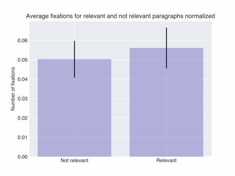

# Visualized Analysis

visualize_analysis.py generates graphs and histograms for an additional desrciptive Analysis

### Perceived relevance vs. System relevance for GoogleNQ Main

####Which paragraphs are frequently rated wrongly? What are probably causes?
TODO: Desrciption of the graph...

TODO: Interpration ...

How ofte

### How long are visit times for relevant and not relevant paragraphs?

   

### On average how many fixations for each visit on a paragraph (relevant/ not relevant)?

### How many fixations   (relevant/ not relevant)?

 

